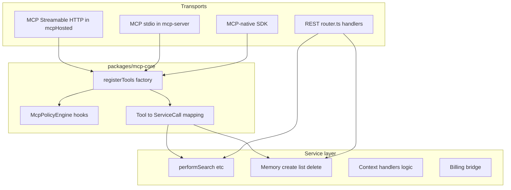

# MCP-as-spine transformation roadmap

Strategic direction: **MCP is the spine of MemoryNode**. SDK and REST exist as secondary layers; every user-facing capability must be reachable through MCP (except explicitly excluded internal ops routes).

---

## Section 1 — Current state snapshot

### 1.1 MCP tools that exist today (canonical + aliases)

**Hosted Streamable MCP** — [`apps/api/src/mcpHosted.ts`](apps/api/src/mcpHosted.ts), factory `createBrandedMcpServer`:

| Registered name | Kind | Notes |
|------------------|------|------|
| `memory` | tool | Unified save / forget / confirm_forget; calls `internalJson` to `POST /v1/memories`, `POST /v1/search`, `DELETE /v1/memories/:id` |
| `recall` | tool | Semantic recall; `POST /v1/search`, optional profile via `GET /v1/memories` |
| `context` | tool | Structured context; `POST /v1/search` + list memories |
| `whoAmI` | tool | Identity (`structuredContent.identity`) |
| `memory_search` | tool | Deprecated alias → `recall` (`aliasBehavior`) |
| `memory_insert` | tool | Deprecated alias → `memory` save |
| `memory_context` | tool | Deprecated alias → `context` |
| `whoami` | tool | Deprecated alias → `whoAmI` |
| `mn-profile` | resource URI `memorynode://profile` | Markdown from `GET /v1/memories` |
| `mn-projects` | resource URI `memorynode://projects` | Static scope documentation |
| `context` | prompt | Registered via `server.registerPrompt` |

**stdio MCP** — [`packages/mcp-server/src/index.ts`](packages/mcp-server/src/index.ts):

| Registered name | Kind | Notes |
|------------------|------|------|
| `recall` | tool | `restFetch` → `POST /v1/search` |
| `context` | tool | Same + local `buildContext` / `deriveContextSignals` |
| `memory` | tool | **Save only**: `inputSchema.action` is `z.enum(["save"]).optional().default("save")` — **no forget path** unlike hosted |
| `whoAmI` | tool | Stdio identity (`workspace_id: "stdio"`) |
| `memory_search`, `memory_context`, `memory_insert` | tools | Deprecated aliases |
| `memory-search` | resource template `memory://search{?q}` | Markdown search results |

### 1.2 REST routes in [`apps/api/src/router.ts`](apps/api/src/router.ts) `route()` with **no** dedicated MCP tool today

Every row below is **no MCP tool** except where MCP indirectly hits the same endpoint (search / memories only).

| Method | Path | Handler surface |
|--------|------|-----------------|
| POST | `/v1/memories/conversation` | `handleCreateConversation` |
| POST | `/v1/ingest` | `handleIngest` |
| POST | `/v1/memories/:id/links` | `handlePostMemoryLink` |
| DELETE | `/v1/memories/:id/links` | `handleDeleteMemoryLink` |
| GET | `/v1/memories` (list) | **Used internally** by MCP recall/context/profile resource, but **no named list tool** |
| GET | `/v1/memories/:id` | `handleGetMemory` |
| GET | `/v1/search/history` | `handleListSearchHistory` |
| POST | `/v1/search/replay` | `handleReplaySearch` |
| POST | `/v1/context` | **REST/SDK only** — MCP `context` tool builds context via search + list, **not** `POST /v1/context` |
| PATCH | `/v1/profile/pins` | `handlePatchProfilePins` |
| GET | `/v1/context/explain` | `handleContextExplain` |
| POST | `/v1/context/feedback` | `handleContextFeedback` |
| GET | `/v1/pruning/metrics` | `handlePruningMetrics` |
| POST | `/v1/explain/answer` | `handleExplainAnswer` |
| GET | `/v1/usage/today` | `handleUsageToday` |
| GET | `/v1/audit/log` | `handleListAuditLog` |
| GET | `/v1/dashboard/overview-stats` | `handleDashboardOverviewStats` |
| GET | `/v1/billing/status` | `handleBillingStatus` |
| POST | `/v1/billing/checkout` | `handleBillingCheckout` |
| POST | `/v1/billing/portal` | `handleBillingPortal` |
| POST | `/v1/webhooks/memory` | `handleMemoryWebhookIngest` |
| POST | `/v1/billing/webhook` | `handleBillingWebhook` |
| POST | `/v1/workspaces` | `handleCreateWorkspace` |
| POST | `/v1/api-keys` | `handleCreateApiKey` |
| GET | `/v1/api-keys` | `handleListApiKeys` |
| POST | `/v1/api-keys/revoke` | `handleRevokeApiKey` |
| POST | `/admin/webhooks/reprocess` | `handleReprocessDeferredWebhooks` |
| POST | `/admin/usage/reconcile` | `handleReconcileUsageRefunds` |
| POST | `/admin/sessions/cleanup` | `handleCleanupExpiredSessions` |
| POST | `/admin/memory-hygiene` | `handleMemoryHygiene` |
| POST | `/admin/memory-retention` | `handleMemoryRetention` |
| GET | `/v1/admin/billing/health` | `handleAdminBillingHealth` |
| GET | `/v1/admin/founder/phase1` | `handleFounderPhase1Metrics` |
| POST | `/v1/import` | `handleImport` |
| GET/PATCH | `/v1/connectors/settings` | `handleGetConnectorSettings` / `handlePatchConnectorSettings` |
| GET/POST/DELETE | `/v1/evals/*` | eval sets/items/run handlers |

**Additional HTTP entrypoints not in `router.ts`** (handled in [`workerApp.ts`](apps/api/src/workerApp.ts) — verify via code search): `GET /healthz`, `GET /ready`, `GET /v1/health`, `POST /v1/dashboard/session`, `POST /v1/dashboard/logout`, hosted MCP paths `/mcp` and `/v1/mcp` (`isHostedMcpPath` in [`mcpHosted.ts`](apps/api/src/mcpHosted.ts)).

### 1.3 Duplication: `mcpHosted.ts` vs `packages/mcp-server/src/index.ts`

- **Shared**: `@modelcontextprotocol/sdk` `McpServer`, tool names `recall`, `context`, `memory` (partial), `whoAmI`, deprecation aliases, `@memorynodeai/shared` `McpPolicyEngine`, `MCP_POLICY_VERSION`, `deriveContextSignals` (stdio), response cache (`McpResponseCache` in API vs `packages/mcp-server/src/cache.js`).
- **Divergence**:
  - **Transport**: Streamable HTTP + session map (`sessions`, `WebStandardStreamableHTTPServerTransport`) vs **stdio** (`StdioServerTransport`).
  - **Scope**: Hosted uses `resolveScope`, `sanitizeScopePart`, API key `AuthContext`, `x-mn-container-tag` / `scopedContainerTag`; stdio uses fixed `MCP_USER_ID = "default"` and `MEMORYNODE_CONTAINER_TAG`.
  - **Forget**: Hosted `memory` supports `forget` / `confirm_forget` + confirmation tokens via `hostedPolicy.issueConfirmationToken` / `consumeConfirmationToken`; stdio **only** `save`.
  - **REST paths**: Hosted uses `internalJson` to same Worker (`resolveRestApiOrigin`); stdio uses `restFetch` to `MEMORYNODE_BASE_URL`.
  - **Resources/prompts**: Hosted registers `memorynode://profile`, `memorynode://projects`, prompt `context`; stdio registers `memory://search` only.

### 1.4 What `McpPolicyEngine` governs today ([`packages/shared/src/mcpPolicy.ts`](packages/shared/src/mcpPolicy.ts))

**Governed** (`McpActionId` union lines 3–9):

- `memory.save`, `memory.forget`, `memory.confirm_forget`, `recall`, `context`, `whoAmI` (MCP tool name target: **`identity_get`**)

**Mechanisms**: session/key/scope rate windows; write replay (`checkReplay` requires `nonce` + `timestampMs` for writes); scope write burst; weak-signal / novelty checks for `memory.save`; forget caps for `memory.forget`; token budget / cost estimation (`estimateCost` — explicit branches for `memory.save`, forget actions, `recall`, `context`); loop / drift detection for `recall` and `context` (`checkLoop`); in-flight concurrency limits; confirmation tokens for `memory.confirm_forget`; metrics (`getMetrics`).

**Does not govern today**:

- Any REST-only or future MCP tool not in `McpActionId`
- Quota / billing entitlements (those are separate: [`mcpHosted.ts`](apps/api/src/mcpHosted.ts) `applyMcpEntitlementAndRateLimits` uses `resolveQuotaForWorkspace`, `rateLimit`, `rateLimitWorkspace` — **outside** `McpPolicyEngine`)
- HTTP search rate limits for non-MCP callers
- Internal ops routes (see Section 3.8)

---

## Section 2 — Target architecture



- **`packages/mcp-core`**: Single registry of tool definitions (name, Zod/input schema, handler that calls **service functions**, not raw HTTP). Used by [`mcpHosted.ts`](apps/api/src/mcpHosted.ts) and [`packages/mcp-server/src/index.ts`](packages/mcp-server/src/index.ts).

- **Internal service functions** (extracted from [`workerApp.ts`](apps/api/src/workerApp.ts) exports such as `performSearch`, `performListMemories`, `deleteMemoryCascade`, `chunkText`, `normalizeSearchPayload`, and handler factories in [`handlers/memories.ts`](apps/api/src/handlers/memories.ts) / [`handlers/search.ts`](apps/api/src/handlers/search.ts) / [`handlers/context.ts`](apps/api/src/handlers/context.ts)): accept `(env, supabase, auth: AuthContext, input)` and return typed results — **no `Response`**, no double-hop HTTP inside the Worker.

- **Three transports after transformation**:
  - **MCP** (primary contract): tools/resources/prompts + `MCP_POLICY_VERSION` + optional `TOOL_MANIFEST_VERSION`.
  - **REST**: thin wrappers that parse HTTP → same service functions → JSON `Response` (`router.ts` delegates to shared services).
  - **SDK**: MCP-native — all public methods invoke MCP tools; REST is not part of the public SDK contract (see Section 7 Sprint 2).

---

## Section 3 — Complete tool inventory (target state)

**Conventions**: Tool names **snake_case**. Tier labels align with plans in Section 6 (**Indie**, **Studio**, **Team**).

### Group 1 — Memory core

| Tool name | Maps to | Input schema (summary) | One sentence | Tier | Priority |
|-----------|---------|-------------------------|--------------|------|----------|
| `memory_save` | POST `/v1/memories` | `user_id`, `namespace`, `text`, optional `metadata`, `memory_type`, `importance`, `chunk_profile`, `extract`, `effective_at`, `replaces_memory_id`, `container_tag` | Persist a memory row and chunks/embeddings | Indie | P1 |
| `memory_forget` | **Behavior**: semantic match + optional confirmation (today hosted `memory` forget path) | `content` / query text, `container_tag`; drives search then delete or staged confirm | Stage or execute forget using search match | Indie | P1 |
| `memory_forget_confirm` | **Behavior**: `confirm_forget` + token / `memory_id` | `confirmation_token`, `memory_id` per policy | Confirm deletion after ambiguous forget | Indie | P1 |
| `memory_conversation_save` | POST `/v1/memories/conversation` | Same owner fields + `messages` / `transcript` + optional extraction flags | Store conversation-derived memory | Studio | P1 |
| `memory_get` | GET `/v1/memories/:id` | `memory_id`, optional `container_tag` | Fetch one memory by UUID | Indie | P1 |
| `memory_delete` | DELETE `/v1/memories/:id` | `memory_id` | Hard-delete memory by id (direct) | Indie | P1 |
| `memory_list` | GET `/v1/memories` | Pagination, `namespace`, owner fields, filters | List memories for scope | Indie | P1 |
| `memory_link_create` | POST `/v1/memories/:id/links` | `from_memory_id`, link payload per contract | Create graph link between memories | Team | P2 |
| `memory_link_delete` | DELETE `/v1/memories/:id/links` | `from_memory_id`, link id per contract | Remove graph link | Team | P2 |
| `profile_pins_update` | PATCH `/v1/profile/pins` | Pins body per API contract | Update pinned profile entries | Studio | P2 |

### Group 2 — Recall and search

| Tool name | Maps to | Input schema | One sentence | Tier | Priority |
|-----------|---------|--------------|--------------|------|----------|
| `search` | POST `/v1/search` | Full `SearchPayload` fields (see [`contracts/search.ts`](apps/api/src/contracts/search.ts)) | Hybrid/vector/keyword search | Indie | P1 |
| `search_history_list` | GET `/v1/search/history` | `limit` | Recent search queries | Studio | P2 |
| `search_replay` | POST `/v1/search/replay` | `query_id` | Replay stored search | Studio | P2 |
| `context_pack` | POST `/v1/context` | Same as search body for context endpoint | Prompt-ready context bundle from API | Indie | P1 |
| `context_explain` | GET `/v1/context/explain` | Query params mirror SDK `contextExplain` | Explain ranking for context | Studio | P2 |
| `context_feedback` | POST `/v1/context/feedback` | Feedback payload types from shared | Submit retrieval feedback | Studio | P2 |
| `explain_answer` | POST `/v1/explain/answer` | `ExplainAnswerRequest` | Explain model answer vs retrieved chunks | Team | P3 |
| `pruning_metrics_get` | GET `/v1/pruning/metrics` | auth scope | Surface pruning telemetry | Team | P3 |

**Deprecation note**: Today’s MCP tools `recall` and `context` become **`search`** and **`context_pack`** respectively (see Section 4 alias table).

### Group 3 — Ingest

| Tool name | Maps to | Input schema | One sentence | Tier | Priority |
|-----------|---------|--------------|--------------|------|----------|
| `ingest_dispatch` | POST `/v1/ingest` | `IngestRequest` | Dispatch ingest pipeline | Studio | P1 |
| `import_archive` | POST `/v1/import` | `artifact_base64`, optional `mode` | Bulk import artifact | Team | P2 |
| `memory_webhook_ingest` | POST `/v1/webhooks/memory` | HMAC + payload | Ingest memory from external webhook source | Team | P2 |

### Group 4 — Profile and identity

| Tool name | Maps to | Input schema | One sentence | Tier | Priority |
|-----------|---------|--------------|--------------|------|----------|
| `identity_get` | **no REST** — identity derived from `AuthContext` | optional session echo | Return workspace, user slice, namespace, policy version | Indie | P1 |
| `health_get` | GET `/healthz` or `/v1/health` | none | Service health metadata | Indie | P3 |
| `dashboard_overview_stats` | GET `/v1/dashboard/overview-stats` | query params per handler | Console overview counters | Studio | P3 |

### Group 5 — Workspace and administration (agent-facing only)

| Tool name | Maps to | Input schema | One sentence | Tier | Priority |
|-----------|---------|--------------|--------------|------|----------|
| `workspace_create` | POST `/v1/workspaces` | `name` (+ admin auth) | Create workspace | Studio | P2 |
| `api_key_create` | POST `/v1/api-keys` | workspace + name | Mint API key | Studio | P2 |
| `api_key_list` | GET `/v1/api-keys` | workspace id | List keys | Studio | P2 |
| `api_key_revoke` | POST `/v1/api-keys/revoke` | `api_key_id` | Revoke key | Studio | P2 |
| `connector_settings_get` | GET `/v1/connectors/settings` | — | Read connector settings | Team | P3 |
| `connector_settings_patch` | PATCH `/v1/connectors/settings` | patch body | Update connector settings | Team | P3 |

Internal ops routes are **not** exposed as MCP tools — see Section 3.8.

### Group 6 — Usage and billing

| Tool name | Maps to | Input schema | One sentence | Tier | Priority |
|-----------|---------|--------------|--------------|------|----------|
| `usage_today` | GET `/v1/usage/today` | — | Today’s usage snapshot | Indie | P2 |
| `audit_log_list` | GET `/v1/audit/log` | pagination | Audit entries | Studio | P2 |
| `billing_get` | GET `/v1/billing/status` | — | Subscription / entitlement status | Indie | P2 |
| `billing_checkout_create` | POST `/v1/billing/checkout` | checkout body | Start checkout session | Indie | P2 |
| `billing_portal_create` | POST `/v1/billing/portal` | portal body | Customer portal | Studio | P2 |

### Group 7 — Evals

| Tool name | Maps to | Input schema | One sentence | Tier | Priority |
|-----------|---------|--------------|--------------|------|----------|
| `eval_set_list` | GET `/v1/evals/sets` | — | List eval sets | Studio | P2 |
| `eval_set_create` | POST `/v1/evals/sets` | `name` | Create eval set | Studio | P2 |
| `eval_set_delete` | DELETE `/v1/evals/sets/:id` | `eval_set_id` | Delete eval set | Studio | P2 |
| `eval_item_list` | GET `/v1/evals/items` | `eval_set_id` | List items | Studio | P2 |
| `eval_item_create` | POST `/v1/evals/items` | set id, query, expected ids | Add eval item | Studio | P2 |
| `eval_item_delete` | DELETE `/v1/evals/items/:id` | `eval_item_id` | Delete item | Studio | P2 |
| `eval_run` | POST `/v1/evals/run` | run payload | Run eval suite | Studio | P1 |

**Resources/prompts (retain + extend)**:

- Keep `memorynode://profile`, `memorynode://projects`; optional **`memorynode://openapi`** (product decision).

### 3.8 — MCP exclusion list (REST-only permanently)

These routes remain **REST-only** — **no MCP tools**:

| Route pattern | Rationale |
|---------------|-----------|
| `POST /admin/webhooks/reprocess` | Internal ops |
| `POST /admin/usage/reconcile` | Internal ops |
| `POST /admin/sessions/cleanup` | Internal ops |
| `POST /admin/memory-hygiene` | Internal ops |
| `POST /admin/memory-retention` | Internal ops |
| `GET /v1/admin/billing/health` | Internal ops |
| `GET /v1/admin/founder/phase1` | Internal ops |
| `POST /v1/billing/webhook` | Provider webhook — not an agent capability |

**Product rationale**: Internal ops routes serve no agent use case and expanding MCP surface increases attack surface without product value.

---

## Section 4 — `packages/mcp-core` specification

### Folder layout (proposed)

```
packages/mcp-core/
  package.json
  tsconfig.json
  src/
    index.ts
    version.ts
    registry/
      registerAllTools.ts
      groups/
        memory.ts
        search.ts
        ingest.ts
        profile.ts
        workspace.ts
        usage_billing.ts
        evals.ts
    policy/
      mapToolToActionId.ts
      enforcePlanGate.ts
    services/
      types.ts
    adapters/
      hosted.ts
      stdio.ts
    aliases/
      deprecation.ts
```

### 4.1 Tool Naming Convention

**Rule:** Every MCP tool name follows **noun_verb** format. No exceptions.

- **noun** = the resource being acted on
- **verb** = the action being performed

**Pattern:** `{noun}_{verb}`

**Approved nouns:**

`memory`, `search`, `context`, `ingest`, `import`, `profile`, `identity`, `workspace`, `api_key`, `connector`, `usage`, `audit`, `billing`, `eval_set`, `eval_item`, `eval`

**Approved verbs:**

`save`, `get`, `list`, `delete`, `create`, `update`, `run`, `pack`, `explain`, `feedback`, `replay`, `dispatch`, `revoke`, `forget`, `confirm_forget`

*Note: `patch` is an HTTP verb and must not appear in tool names. Use `update` instead (e.g. `profile_pins_update`, not `profile_pins_patch`).*

**Examples of correct names:**

| Name | Verdict |
|------|---------|
| `memory_save` | ✓ (noun: memory, verb: save) |
| `memory_get` | ✓ |
| `memory_list` | ✓ |
| `memory_delete` | ✓ |
| `memory_forget` | ✓ |
| `memory_forget_confirm` | ✓ (exception: compound verb, approved) |
| `search` | ✓ — **canonical exception** to noun_verb (single word); see exceptions register |
| `context_pack` | ✓ (`pack` = assemble into context bundle) |
| `identity_get` | ✓ (noun: identity, verb: get) |
| `eval_run` | ✓ |
| `api_key_create` | ✓ |
| `api_key_revoke` | ✓ |
| `billing_get` | ✓ |
| `billing_checkout_create` | ✓ |
| `billing_portal_create` | ✓ |

**Enforcement rule:** No tool name is merged into `mcp-core` without passing this check. Add a **CI lint step in Sprint S1** that validates all registered tool names against the noun_verb regex pattern:

`^[a-z]+(_[a-z]+){1,3}$`

**Exceptions register** (must be explicitly approved and logged here):

- **`search`** — kept as single-word canonical exception for the primary recall tool. **Rationale:** most frequently called tool in the product; brevity materially aids agent discovery; no noun_verb alternative improves clarity.
- Any future exception requires a note in this register with rationale before merge.

### 4.2 Tool Description Quality Standard

**Why this matters:** Agent routing depends entirely on how tool descriptions are written. A poorly written description means an agent calls the wrong tool. A well written description means an agent routes correctly without any extra prompting from the developer using MemoryNode.

Every tool description registered in `mcp-core` must answer **all four** of the following questions. No tool ships without all four.

**Template:**

```
WHAT: [One sentence — what this tool does in plain terms]
WHEN: [One sentence — when an agent should call this tool]
INSTEAD: [One sentence — what to use instead if there is a similar tool, and why]
RETURNS: [One sentence — what the tool returns on success]
```

**Worked examples:**

**memory_save:**

- **WHAT:** Persists a piece of information to long-term memory for a specific user or account.
- **WHEN:** Call this after any conversation turn where the user shares a fact, preference, goal, or context worth remembering across future sessions.
- **INSTEAD:** Use `memory_conversation_save` if you have a full conversation transcript to ingest at once rather than a single fact.
- **RETURNS:** The saved memory object including its assigned UUID and timestamp.

**search:**

- **WHAT:** Performs hybrid semantic and keyword search across all stored memories for a user or account.
- **WHEN:** Call this when you need to find specific facts, preferences, or past context before responding.
- **INSTEAD:** Use `context_pack` if you want a fully assembled prompt-ready context block rather than raw search results.
- **RETURNS:** Ranked list of matching memory chunks with relevance scores.

**context_pack:**

- **WHAT:** Assembles a complete prompt-ready context bundle from memory — profile, recent history, ranked recall results — formatted for direct injection into a system prompt.
- **WHEN:** Call this at the start of a conversation turn when you want the richest possible memory context without building it yourself.
- **INSTEAD:** Use `search` if you need raw search results to process yourself rather than a pre-assembled bundle.
- **RETURNS:** A structured context object with profile, memories, and a ready-to-use prompt string.

**memory_forget:**

- **WHAT:** Finds and soft-deletes a memory by semantic search rather than by ID.
- **WHEN:** Call this when a user says they want the AI to forget something and you do not have the memory UUID.
- **INSTEAD:** Use `memory_delete` if you already have the memory UUID — it is faster and more precise.
- **RETURNS:** A confirmation token required to complete deletion via `memory_forget_confirm`.

**Enforcement rule:** PR review checklist for every new tool in `mcp-core` must include: *“Does this tool description answer all four WHAT / WHEN / INSTEAD / RETURNS questions?”* Merge is blocked if any question is missing or answered with a placeholder.

### Alias table (canonical deprecations)

| Alias (old) | Canonical (new) |
|-------------|-----------------|
| `memory` | `memory_save` |
| `recall` | `search` |
| `memory_search` | `search` |
| `memory_insert` | `memory_save` |
| `memory_context` | `context_pack` |
| `whoami` | `identity_get` |

Implement via centralized `aliases/deprecation.ts` using the same mechanism as `normalizeDeprecationPhase` / `resolveAliasDecision` today ([`mcpHosted.ts`](apps/api/src/mcpHosted.ts), [`packages/mcp-server`](packages/mcp-server)).

### Registration, services, policy, versioning

- `registerAllTools(server, ctx, mode)` registers **snake_case** tools; aliases registered only for backward compatibility during migration.
- Handlers call extracted service functions (Section 5), not `internalJson` inside the Worker after migration.
- Extend `McpPolicyEngine` for new `McpActionId` values aligned with **`memory_save` / `memory_forget` / `memory_forget_confirm` / `search` / `context_pack` / `identity_get`** naming in policy layer (map from tool names).
- **`MCP_POLICY_VERSION`** + **`TOOL_MANIFEST_VERSION`** in `mcp-core/version.ts`.

**`TOOL_MANIFEST_VERSION` versioning rules:**

- **Patch bump:** new tool added, no existing tool changed
- **Minor bump:** existing tool description changed, schema unchanged
- **Major bump:** tool renamed, removed, or input schema changed in a breaking way
- **`identity_get`** returns both `MCP_POLICY_VERSION` and `TOOL_MANIFEST_VERSION` on every call
- Clients should log `TOOL_MANIFEST_VERSION` on connect for debugging

---

## Section 5 — Service layer extraction plan

### From [`workerApp.ts`](apps/api/src/workerApp.ts)

Exported / key: `performSearch`, `performListMemories`, `deleteMemoryCascade`, `chunkText`, `chunkTextWithProfile`, `dedupeFusionResults`, `finalizeResults`, `normalizeSearchPayload`, `normalizeMemoryListParams`, `importArtifact`, `buildExportArtifact`, `assertBodySize`, `safeKvTtl`, `makeExportResponse`, `handleRequest` stays orchestration.

**Extract** into `apps/api/src/services/` (exact package boundary **NEEDS VERIFICATION** during implementation).

### From [`handlers/memories.ts`](apps/api/src/handlers/memories.ts)

Dedupe (`canonical_hash`, `semantic_fingerprint`), chunk insert into `memory_chunks`, OpenAI extraction path → `createMemoryService`, `insertChunksForMemory`, etc.

### Internal interface (sketch)

```ts
export type ServiceContext = {
  env: Env;
  supabase: SupabaseClient;
  auth: AuthContext;
  requestId: string;
};
```

---

## Section 6 — Pricing, plans, quotas, and `McpPolicyEngine` extension

### Plans (internal = external naming)

| Plan | Price | Positioning | PlanId |
|------|-------|-------------|--------|
| Indie | ₹999/month | Solo Builder | `indie` |
| Studio | ₹4,999/month | Agency | `studio` |
| Team | ₹14,999/month | B2B SaaS | `team` |

**Free entry**: 14-day trial on **Indie**, no card required. **No separate free PlanId** — trial is a **quota + time gate** on the **indie** plan.

### Quotas per plan (product source of truth for implementation)

| Dimension | Indie | Studio | Team |
|-----------|-------|--------|------|
| Memory saves / month | 5,000 | 50,000 | 500,000 |
| Search ops / month | 10,000 | 100,000 | 1,000,000 |
| Scoped users | 50 | 2,000 | unlimited |
| Workspaces | 1 | 20 | unlimited |
| API keys | 2 | 10 | unlimited |
| Data retention | 90 days | 1 year | unlimited |
| MCP tools | Core | Core + Ingest + Evals | All |
| Overage | blocked | blocked | per-op charge |

### `packages/shared/src/plans.ts` change note

- Replace the `PlanId` union with **`'indie' | 'studio' | 'team'`** only — remove legacy values (`launch`, `build`, `deploy`, `scale`, `scale_plus`) during implementation migration.

### Trial representation

- **PlanId** stays **`indie`** for trial users.
- Add boolean **`trial`** field to **workspace** row in DB.
- Add **`trial_expires_at`** timestamp to workspace row.
- **`AuthContext` shape:** `{ plan: 'indie' | 'studio' | 'team', trial: boolean, trialExpiresAt: Date | null }` (exact field names **NEEDS VERIFICATION** at implementation to match codebase conventions).
- **`McpPolicyEngine`** reads **`trial`** flag to enforce time-box.
- **On expiry:** reads allowed, writes blocked until card added.
- **Migration task** assigned to **Sprint S7**.

### `McpPolicyEngine` extension (with Indie / Studio / Team)

1. **`planGate(toolName, planId)`** where `planId` is **`indie` | `studio` | `team`** — enforce **MCP tools** column above (Core vs Core+Ingest+Evals vs All).
2. **Quota gates**: align session/key limits with **memory saves** and **search ops** monthly buckets per plan (integrate with existing `resolveQuotaForWorkspace` / usage accounting in [`mcpHosted.ts`](apps/api/src/mcpHosted.ts)).
3. **Trial:** enforce Section 6 **Trial representation** — time-box via `trial` + `trial_expires_at`; on expiry allow reads, block writes until card added; do not grant Studio/Team tool tiers during trial.
4. **Overage**: Indie + Studio — hard block at limits; Team — allow per-op charge path (billing integration **NEEDS VERIFICATION**).
5. Extend **`McpActionId`** / **`estimateCost`** for tools beyond today’s six actions as tools ship.

---

## Section 7 — Sprint breakdown

### 7.1 Global Rollback Principles

1. Every sprint has exactly one **rollback owner** — the engineer who wrote the sprint. They are responsible for executing rollback if triggered.

2. **Rollback is always faster than forward-fix in production.** Never attempt to fix a production incident in-place if rollback is available. Rollback first, fix in staging, redeploy.

3. **Feature flags over big-bang deploys.** Where possible, new MCP tools are registered behind a `TOOL_ENABLED_<NAME>=true` env var so they can be disabled in production without a code revert.

4. **Baseline metrics** recorded before every sprint that touches performance (S3, S5). No sprint closes without a recorded before/after comparison.

5. **Security rollbacks** (S6 billing group) are treated as incidents regardless of whether data exposure is confirmed. Unregister first, investigate second.

| Sprint | Goal | Create | Modify | Delete / deprecate | DoD | Effort | Rollback trigger | Rollback steps | Rollback time |
|--------|------|--------|--------|---------------------|-----|--------|------------------|----------------|---------------|
| **S1** — Scaffold mcp-core | `packages/mcp-core` exists, hosted MCP boots importing from it; existing tools behave identically. | `packages/mcp-core/**`, [`pnpm-workspace.yaml`](pnpm-workspace.yaml) entry | [`mcpHosted.ts`](apps/api/src/mcpHosted.ts) imports registry from mcp-core | None | Existing integration tests pass unchanged | 5–7 days | Any existing MCP tool returns different output or hosted MCP fails to boot | Revert `mcpHosted.ts` import to inline registration; keep `mcp-core` package but remove from workspace until fixed | < 30 minutes (single import revert) |
| **S2** — SDK MCP-native (moved from S7) | SDK ships MCP transport as only public interface. No existing users so no migration cost. | New transport layer in [`packages/sdk/src/mcp-transport.ts`](packages/sdk/src/mcp-transport.ts) | [`packages/sdk/src/index.ts`](packages/sdk/src/index.ts) — all methods call MCP tools | Direct REST `fetch` calls from public SDK methods | All SDK methods call MCP tools; REST is internal only; published as new semver major | 8–12 days | MCP transport error rate > 1% in staging | Revert `packages/sdk` to previous commit; unpublish npm version if already published; republish previous version | < 1 hour (npm unpublish + republish) |
| **S3** — Eliminate Worker double-hop | `search` and `context_pack` MCP tools call internal service functions directly, not `internalJson` HTTP. | [`apps/api/src/services/search.ts`](apps/api/src/services/search.ts), [`apps/api/src/services/memory.ts`](apps/api/src/services/memory.ts) | [`mcpHosted.ts`](apps/api/src/mcpHosted.ts) hot tools use service imports | None — `internalJson` stays for REST handlers | p50 latency baseline recorded before sprint; p50 after sprint within baseline + 20% | 6–8 days | p50 latency increases or error rate spikes above pre-sprint baseline on search or recall | Revert `mcpHosted.ts` to `internalJson` calls for affected tools; service files stay in codebase but unused until fixed | < 30 minutes (revert two tool handlers) |
| **S4** — Fix stdio parity | stdio MCP matches hosted on forget, scoping, resources. | None | [`packages/mcp-server/src/index.ts`](packages/mcp-server/src/index.ts) — dynamic userId/namespace from env, forget path, resources aligned with hosted | Hardcoded `MCP_USER_ID = "default"` | Stdio integration test matrix passes for multi-user scope; forget tool works on stdio | 3–5 days | Stdio memory tool produces scoping errors or data mixing in test | Revert `packages/mcp-server` to previous commit; restore `MCP_USER_ID` default behavior with warning | < 20 minutes (single package revert) |
| **S5** — P1 tool coverage | All P1 tools from Section 3 registered in mcp-core and live on hosted MCP. | Tool modules in `mcp-core/src/registry/groups/` | `registerAllTools.ts` to include new groups | None | Tool manifest lists all P1 tools; contract test per tool passes; noun_verb lint passes; all four description fields present per tool | 8–10 days | Any P1 tool causes unhandled error in production or policy bypass detected | Unregister affected tool from `registerAllTools.ts`; redeploy; file remains in codebase for fix | < 30 minutes (remove one import + redeploy) |
| **S6** — Billing, usage, audit tools | Group 6 tools live; SOC2-relevant audit accessible via MCP. | `mcp-core/src/registry/groups/usage_billing.ts` | `registerAllTools.ts` | None | `usage_today`, `audit_log_list`, `billing_get` accessible via MCP; plan gate enforced per tool | 5–7 days | Billing data exposed to wrong workspace or plan gate bypassed | Unregister all Group 6 tools immediately; redeploy; treat as security incident if data exposure confirmed | < 15 minutes (critical path — fastest rollback in the register) |
| **S7** — Admin connector tools + plan gates | Group 5 non-admin tools live; `McpPolicyEngine` extended for indie/studio/team gates. | `mcp-core/src/registry/groups/workspace.ts`, `mcp-core/src/policy/enforcePlanGate.ts` | `McpPolicyEngine` — extend `McpActionId`; [`mcpHosted.ts`](apps/api/src/mcpHosted.ts) `applyMcpEntitlementAndRateLimits` uses indie/studio/team PlanIds | Old plan references (`launch` / `build` / `deploy` / `scale` / `scale_plus`) | Tool access blocked correctly by plan in integration tests; attempted misuse returns consistent error codes; [`plans.ts`](packages/shared/src/plans.ts) PlanId union = `'indie' \| 'studio' \| 'team'` only; **`AuthContext.plan` migrated to `indie` \| `studio` \| `team`; trial flag present on workspace row; DB migration script tested on staging** | 6–8 days | Plan gate returns wrong result for any PlanId in test matrix | Revert `enforcePlanGate.ts` to previous version; restore old PlanId union temporarily if database mismatch detected | < 45 minutes (policy revert + plans.ts revert) |

### 7.2 Execution sequence (dependency order)

Use this order when implementing or reviewing work — later steps assume earlier contracts exist.

| Step | Scope | Notes |
|------|--------|--------|
| 1 | **S1 → S5** | `mcp-core` scaffold → SDK MCP transport → (optional S3 double-hop removal) → stdio parity → P1 hosted tools + manifest/lint. |
| 2 | **S6** | Usage / audit / billing MCP tools + hosted `planGate` hooks for tier-sensitive tools. |
| 3 | **S7 — data model** | Workspace DB: `trial`, `trial_expires_at` ([`063_workspace_trial.sql`](infra/sql/063_workspace_trial.sql)); migrate [`plans.ts`](packages/shared/src/plans.ts) **PlanId** to `indie` \| `studio` \| `team`; align billing + quota readers. Shared helper [`productPlanFromWorkspacePlan`](packages/shared/src/productPlan.ts) maps current `free`/`pro`/`team` rows until columns are renamed. |
| 4 | **S7 — auth** | [`AuthContext`](apps/api/src/auth.ts): **`productPlan`** (`ProductPlanId`) derived from `workspaces.plan` via [`productPlanFromWorkspacePlan`](packages/shared/src/productPlan.ts); **`trial`** / **`trialExpiresAt`** from DB; legacy **`plan`** (`pro`\|`team`) unchanged for RPM/MCP gates until migration. **`identity_get`** exposes `product_plan`, `api_plan`, trial fields. |
| 5 | **S7 — policy** | Extend `McpPolicyEngine` / quotas per Section 6; centralize tier rules in [`enforcePlanGate.ts`](packages/mcp-core/src/policy/enforcePlanGate.ts) (`createHostedMcpPlanGate`) + optional future `planGate(tool, planId)` when PlanIds are live everywhere. |
| 6 | **S7 — MCP surface** | Group 5 non-admin tools (connectors done first — API key auth); workspace/API-key admin routes remain **REST / admin-token** unless product adds a scoped MCP↔admin bridge. |
| 7 | **Coverage** | Integration tests: plan matrix (`indie` / `studio` / `team`) + trial expiry behavior; manifest parity hosted vs stdio where applicable. |

**SDK note:** No existing users — ship MCP-native SDK from first publish; no deprecation timeline for prior REST-first SDK.

---

## Section 8 — Risk register

| Risk | Affects | Detect | Mitigate |
|------|---------|--------|----------|
| Circular deps (`mcp-core` ↔ `apps/api`) | `packages/mcp-core`, `workerApp.ts` | `pnpm typecheck` | Interfaces in `packages/shared` |
| Policy bypass on new tools | `mcpPolicy.ts` | Per-tool tests | Central `enforcePolicy` |
| stdio/hosted drift | `mcp-server`, `mcpHosted.ts` | CI manifest snapshot | Single `registerAllTools` |
| Plan migration (`plans.ts`) breaks billing | `plans.ts`, billing handlers | Staging billing tests | Migration playbook + feature flag |
| Trial mis-billed as paid Studio | auth/workspace | Audit trial flag | Single source of truth for trial |

---

## Section 9 — Decision log

| # | Decision | Rationale |
|---|----------|-----------|
| 1 | **Three plans only** — PlanIds **`indie`**, **`studio`**, **`team`**; same names internally and externally | Removes mapping drift; aligns code, billing, and docs. |
| 2 | **Pricing and quotas** — Indie ₹999, Studio ₹4,999, Team ₹14,999; trial = 14-day Indie without card; quotas and MCP tool tiers as in Section 6 | Clear GTM and enforceable gates in policy + billing. |
| 3 | **Tool split** — `memory_save`, `memory_forget`, `memory_forget_confirm`; **`search`** and **`context_pack`** replace `recall` / `context`; aliases in Section 4 | Explicit agent semantics; deprecations are named and enumerable. |
| 4 | **Admin exclusion** — No MCP tools for internal ops routes or `POST /v1/billing/webhook`; Section 3.8 REST-only | Agents do not need ops webhooks; smaller attack surface. |
| 5 | **SDK ASAP** — Sprint 2 ships **MCP-native SDK** as the **only** public interface; REST internal; no legacy users | First publish is correct architecture; no dual-maintenance period. |
| 6 | **`search` kept as single-word tool name** — canonical exception to noun_verb rule | Most frequently called tool in the product; brevity materially aids agent discovery; no noun_verb alternative improves clarity. |

---

## Section 10 — Success metrics

**Technical completeness**

- Every agent-relevant `/v1/*` route in [`router.ts`](apps/api/src/router.ts) has an MCP tool **or** appears in Section 3.8.
- **`plans.ts`** uses only `indie` | `studio` | `team` + trial representation.

**Performance**

- Hosted MCP **`search`** (and `context_pack`): p50 within agreed threshold after removing double-hop — baseline recorded in Sprint S3.

**Tests**

- Manifest parity: stdio vs hosted tool list + alias table.
- Policy + plan gate tests per **`indie` / `studio` / `team`** and trial.

**Description quality**

- **100%** of registered tools have all four fields (**WHAT** / **WHEN** / **INSTEAD** / **RETURNS**) populated (Section 4.2).
- Verified by **CI lint** that parses tool descriptions and fails on missing or placeholder text.

---

## Appendix — `AuthContext` and PlanId migration

See **Section 6** — **Trial representation** and **`packages/shared/src/plans.ts` change note** for the authoritative spec (`AuthContext` shape, workspace `trial` / `trial_expires_at`, PlanIds **`indie` \| `studio` \| `team`**). Implementation is tracked in **Sprint S7** DoD. [`apps/api/src/auth.ts`](apps/api/src/auth.ts) currently types `plan` as **`pro` \| `team`**; converge during that sprint.
