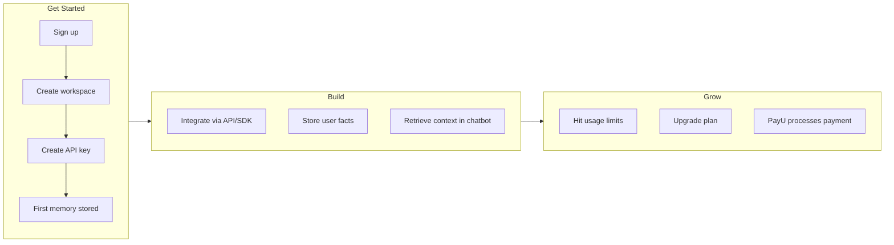
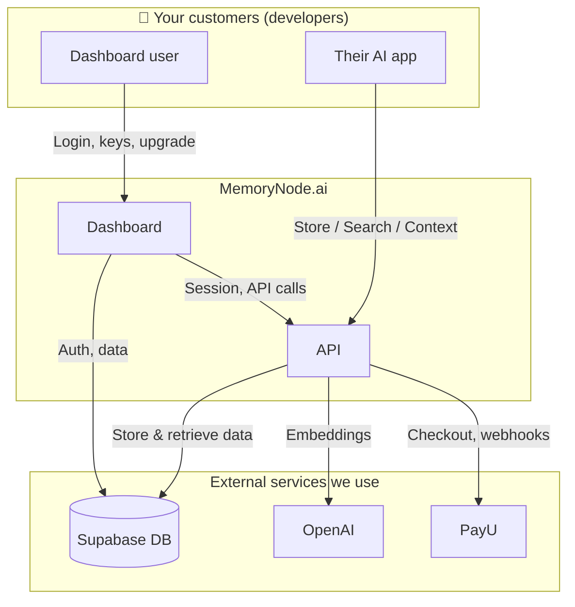

# MemoryNode.ai — Architecture for CEOs & Founders

**Purpose:** A non-technical, end-to-end view of how MemoryNode.ai works — so you can explain the product, onboard investors, and make informed decisions.

---

## In One Sentence

**MemoryNode.ai is a "memory layer for AI apps"** — developers store facts and conversations in our system, then retrieve the right context when their chatbot or assistant needs it.

---

## The Big Picture

```
┌─────────────────────────────────────────────────────────────────────────────────┐
│                          YOUR CUSTOMERS (Developers)                              │
│         They build: chatbots, copilots, AI assistants for their own users         │
└───────────────────────────────┬─────────────────────────────────────────────────┘
                                │
                    ┌───────────┴───────────┐
                    │                       │
                    ▼                       ▼
        ┌───────────────────┐   ┌───────────────────┐
        │  WEB DASHBOARD    │   │  API + SDK        │
        │  (app.memorynode) │   │  (api.memorynode) │
        │                   │   │                   │
        │  • Sign up / log  │   │  • Store memories │
        │  • Create spaces  │   │  • Search memories│
        │  • Manage keys    │   │  • Get context    │
        │  • View usage     │   │  • Upgrade plan   │
        │  • Upgrade plan   │   │                   │
        └─────────┬─────────┘   └─────────┬─────────┘
                  │                       │
                  └───────────┬───────────┘
                              │
                              ▼
              ┌───────────────────────────────┐
              │   MEMORYNODE API (Cloudflare)  │
              │   The brain of the product     │
              └───────────────┬───────────────┘
                              │
        ┌─────────────────────┼─────────────────────┐
        │                     │                     │
        ▼                     ▼                     ▼
┌───────────────┐   ┌───────────────┐   ┌───────────────┐
│   Supabase    │   │   OpenAI      │   │   PayU        │
│   (Database)  │   │   (AI magic)  │   │   (Billing)   │
│               │   │               │   │               │
│  • All data   │   │  • Turns text │   │  • Take money │
│  • User login │   │    into math  │   │  • Webhooks   │
│  • Workspaces │   │  • Smart      │   │  • Upgrades   │
│  • Memories   │   │    search     │   │               │
└───────────────┘   └───────────────┘   └───────────────┘
```

---

## How It Works: The Memory Journey

### 1️⃣ Store a Memory (Write)

When a developer (or their app) stores something like *"User John prefers dark mode"*:

```
Developer's app  →  API  →  Split into chunks  →  OpenAI turns text into numbers (embeddings)
                                                              ↓
                                              Supabase stores: text + numbers
```

**In plain English:** We break the text into pieces, use OpenAI to convert each piece into a "fingerprint" of numbers, then save both the original text and the fingerprint. The fingerprint lets us do smart, meaning-based search later.

---

### 2️⃣ Search / Retrieve (Read)

When the chatbot needs context (e.g. user asks *"What theme do I like?"*):

```
Developer's app  →  API  →  OpenAI turns query into numbers  →  Supabase finds similar fingerprints
                                                                         ↓
                                              Returns the most relevant stored memories
```

**In plain English:** We turn the user’s question into a fingerprint too, then find the stored memories whose fingerprints are closest. That gives us the most relevant memories for the current question.

---

### 3️⃣ Where Value Comes From

| What | Why it matters |
|------|----------------|
| **Storage** | Data is isolated per workspace and user — safe and private |
| **Smart search** | Vector + keyword search so results match both meaning and words |
| **Context endpoint** | Returns text ready to drop into an AI prompt — one call, done |
| **Usage limits** | Launch / Build / Deploy / Scale / Scale+ caps — see [Plans & Limits](README.md#plans--limits) in docs. |
| **Dashboard** | Create workspaces, keys, see usage, upgrade — self-serve |

---

## Main Components (Who Does What)

| Component | What it is | Your role |
|-----------|------------|-----------|
| **Dashboard** | Web app at app.memorynode.ai | Users sign up, manage workspaces, keys, upgrade |
| **API** | Backend running on Cloudflare Workers | Handles all memory and billing logic |
| **SDK** | Small code library | Developers use it to call the API from their apps |
| **Supabase** | Hosted database + auth | Stores data and manages login |
| **OpenAI** | Embeddings API | Powers the "smart search" (meaning-based retrieval) |
| **PayU** | Payment provider | Collects payments, sends webhooks when someone upgrades |
| **Cloudflare** | Hosting for API | Runs the API at scale, handles traffic |
| **Status page** | status.memorynode.ai | Shows uptime and incidents to customers |

---

## Customer Journey (End to End)



---

## Data Flow: Store → Search → Billing



---

## Quick Reference: URLs & Deployments

| What | URL / Location |
|------|----------------|
| Dashboard | app.memorynode.ai |
| API | api.memorynode.ai |
| Status page | status.memorynode.ai |
| API code | `apps/api` |
| Dashboard code | `apps/dashboard` |
| Database schema | `infra/sql/` |
| Docs | `docs/` |

---

## Glossary (Plain English)

| Term | Meaning |
|------|---------|
| **Workspace** | A customer’s account — contains all their data and API keys |
| **API key** | Secret token a developer uses to call our API from their app |
| **Memory** | A stored fact or snippet (e.g. "User loves coffee") |
| **Embedding** | A numeric "fingerprint" of text — lets us do meaning-based search |
| **Context** | Formatted text of relevant memories, ready to inject into an AI prompt |
| **Plan** | Launch (7-day paid trial), Build, Deploy, Scale, Scale+ — see [Plans & Limits](README.md#plans--limits). Launch is the paid 7-day trial (no free tier). |

---

*Last updated: Feb 2025. For technical details, see `docs/API_REFERENCE.md`.*
