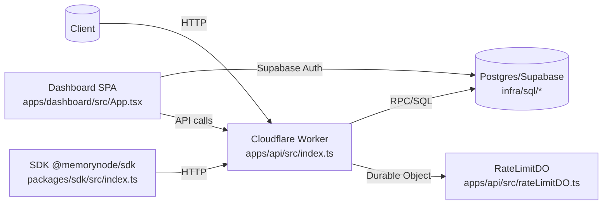

# Architecture

## Components & Boundaries
- **Cloudflare Worker API** – router in `apps/api/src/index.ts:400-550` dispatches all HTTP endpoints (memories, search/context, usage, billing, admin, export/import).
- **RateLimit Durable Object** – windowed counter stored in DO state (`apps/api/src/rateLimitDO.ts`), bound as `RATE_LIMIT_DO` in `apps/api/wrangler.toml`.
- **Supabase/Postgres** – data plane; tables and RPCs defined in `infra/sql/*.sql` (e.g., `001_init.sql`, `002_rpc.sql`, `003_usage_rpc.sql`, `009_workspace_rpc.sql`, `011_api_key_rpcs.sql`, `014_activation.sql`, `015_invites.sql`, `016_webhook_events.sql`), accessed via `@supabase/supabase-js` in the Worker.
- **Dashboard SPA** – React + Supabase auth at `apps/dashboard/src/App.tsx`, API client in `apps/dashboard/src/apiClient.ts`, Supabase client in `apps/dashboard/src/supabaseClient.ts`.
- **SDK** – `packages/sdk/src/index.ts` TypeScript client mirroring Worker endpoints; relies on shared contracts `packages/shared/src/index.ts`.
- **Shared Types** – request/response interfaces used by API and SDK (`packages/shared/src/index.ts`).

## Diagram (Mermaid)

## Implemented Flows (code-traced)
- **Ingest**: `POST /v1/memories` → `handleCreateMemory` (auth + `rateLimit`) validates `user_id`/`text`, enforces `MAX_TEXT_CHARS` and route body limit (`apps/api/src/index.ts:373-392, 830-930`). Text split via `chunkText` paragraph-aware with overlap (`apps/api/src/index.ts:1760-1795`). Embeddings from OpenAI or stub depending on `EMBEDDINGS_MODE` (`apps/api/src/index.ts:1840-1895, 2140-2156`). Inserts `memories` and `memory_chunks` with vector strings, bumps usage via `bump_usage` RPC (`apps/api/src/index.ts:2230-2255`) and emits product event.
- **Search**: `POST /v1/search` → `handleSearch` (auth + rateLimit) → `normalizeSearchPayload` for filters/limits (`apps/api/src/index.ts:1215-1310`) → embeds query → RPCs `match_chunks_vector` / `match_chunks_text` defined in `infra/sql/002_rpc.sql` and invoked via `callMatchVector`/`callMatchText` (`apps/api/src/index.ts:1905-1950`). Results fused with `reciprocalRankFusion` and deduped (`apps/api/src/index.ts:1960-2055`), paginated by `finalizeResults`.
- **Context**: `POST /v1/context` reuses search pipeline then builds concatenated `context_text` with citations (`apps/api/src/index.ts:1113-1175`).
- **Export**: `POST /v1/export` → `exportArtifact` gathers workspace memories/chunks, builds manifest v1 + NDJSON, zips with JSZip, size-capped (`apps/api/src/index.ts:1540-1635`).
- **Import**: `POST /v1/import` → `importArtifact` validates manifest/workspace/version, size, and `mode` (`upsert|skip_existing|error_on_conflict|replace_ids|replace_all`), writes `memories`/`memory_chunks` (`apps/api/src/index.ts:1608-1695`).
- **Usage**: `GET /v1/usage/today` → `handleUsageToday` reads `usage_daily`, applies caps for effective plan (`apps/api/src/index.ts:2634-2664`; caps in `apps/api/src/limits.ts`).
- **Billing**: `/v1/billing/status|checkout|portal|webhook` with Stripe env validation (`apps/api/src/index.ts:180-230, 2667-2977`); webhook stores events in `stripe_webhook_events` (`infra/sql/016_webhook_events.sql`).
- **Admin**: `/v1/workspaces`, `/v1/api-keys`, `/v1/api-keys/revoke` behind `x-admin-token` plus rate limit (`apps/api/src/index.ts:2365-2547`).

## Runtime / Deploy Model
- Worker configured in `apps/api/wrangler.toml` (main `src/index.ts`, dev port 8787, Durable Object binding `RATE_LIMIT_DO`, migration tag `v1`).
- Env vars loaded via `.dev.vars` / Wrangler vars; `Env` interface lists required/optional keys (`apps/api/src/index.ts:16-44`; template `apps/api/.dev.vars.template`).
- Dashboard served by Vite (`apps/dashboard/vite.config.ts`); envs in `apps/dashboard/.env.example`; dev server default 4173 (`apps/dashboard/README.md`).
- Monorepo tooling: pnpm workspace (`pnpm-workspace.yaml`); scripts in root `package.json` (`dev`, `dev:api`, `lint`, `typecheck`, `test`, `smoke`, `smoke:ps`).

## Storage Model
- Core tables: `workspaces`, `api_keys`, `memories`, `memory_chunks` (vector(1536) with ivfflat index, `tsv` GIN), `usage_daily` (`infra/sql/001_init.sql`).
- Aux tables: `api_audit_log` (`infra/sql/005_api_audit_log.sql`), billing fields on `workspaces` + indexes (`infra/sql/012_billing.sql`), `product_events` (`infra/sql/013_events.sql`), membership + policies (`infra/sql/008_membership_rls.sql`), `workspace_invites` (`infra/sql/015_invites.sql`), `stripe_webhook_events` (`infra/sql/016_webhook_events.sql`).
- RPCs: search (`infra/sql/002_rpc.sql`), usage bump (`infra/sql/003_usage_rpc.sql`), workspace/API key creation/list/revoke (`infra/sql/009_workspace_rpc.sql`, `infra/sql/011_api_key_rpcs.sql`), activation metrics (`infra/sql/014_activation.sql`), invites management (`infra/sql/015_invites.sql`).

## Security Model (implemented)
- **Auth**: API key via `x-api-key` or Bearer hashed with `API_KEY_SALT` (env or `app_settings`) in `authenticate` (`apps/api/src/index.ts:1185-1235`; `infra/sql/011_api_key_rpcs.sql`). Admin endpoints require `x-admin-token` checked in `requireAdmin` (`apps/api/src/index.ts:2320-2365`).
- **Rate limiting**: `rateLimit` calls Durable Object; headers `x-ratelimit-limit`, `x-ratelimit-remaining`, `x-ratelimit-reset`, `retry-after`; DO logic in `apps/api/src/rateLimitDO.ts`.
- **Usage caps**: per-plan caps from `apps/api/src/limits.ts` enforced via `checkCapsAndMaybeRespond` before ingest/search/context (`apps/api/src/index.ts:298-333`).
- **Body limits**: per-route limits via `resolveBodyLimit` (`apps/api/src/index.ts:373-392`).
- **CORS / security headers**: allowlist `ALLOWED_ORIGINS`; `buildSecurityHeaders` sets `cache-control` no-store for sensitive paths (`apps/api/src/index.ts:399-417`).
- **RLS/tenancy**: policies in `infra/sql/006_rls.sql` and membership-based `infra/sql/008_membership_rls.sql`; workspace membership required.
- **Audit logging**: `emitAuditLog` writes `api_audit_log` with salted IP (`apps/api/src/index.ts:1410-1478`; `infra/sql/005_api_audit_log.sql`).
- **Billing safety**: env checks `missingStripeEnv`/`getStripeClient`; webhook signature verification (`apps/api/src/index.ts:180-230, 2870-2940`).
- **Redaction**: `redact` masks sensitive values in logs (`apps/api/src/index.ts:1497-1525`).

## Observability
- Request summary JSON logs in router finally block (`apps/api/src/index.ts:520-550`).
- Product events persisted via `emitProductEvent` into `product_events` (`apps/api/src/index.ts:70-120, 239-260`; `infra/sql/013_events.sql`).
- Audit logs persisted per request (`apps/api/src/index.ts:1410-1478`).

## Limitations (evidence)
- `tsc -b` fails: `STRIPE_SECRET_KEY` possibly undefined in `getStripeClient` (`apps/api/src/index.ts:214-230`; `corepack pnpm typecheck` result).
- Worker requires `RATE_LIMIT_DO`; `ensureRateLimitDo` throws 500 if binding missing (`apps/api/src/index.ts:360-371`).
- Stub Supabase/embeddings allowed only when not production (`apps/api/src/index.ts:2140-2156`).
