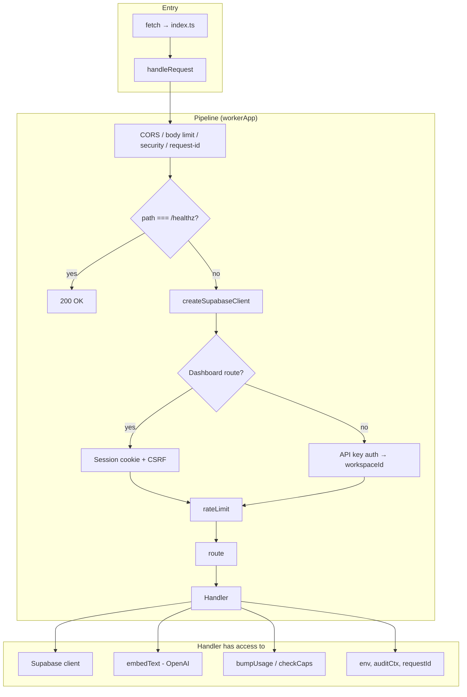
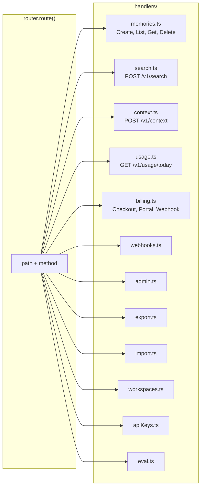
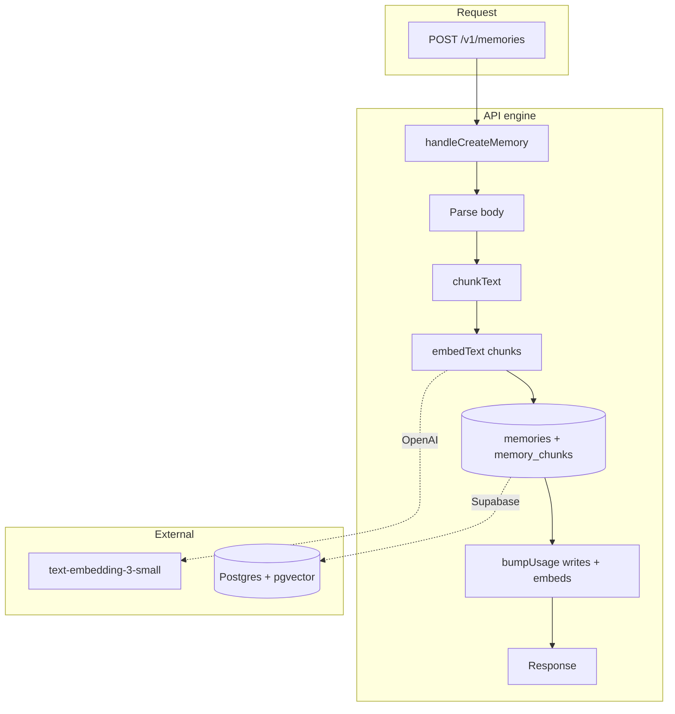
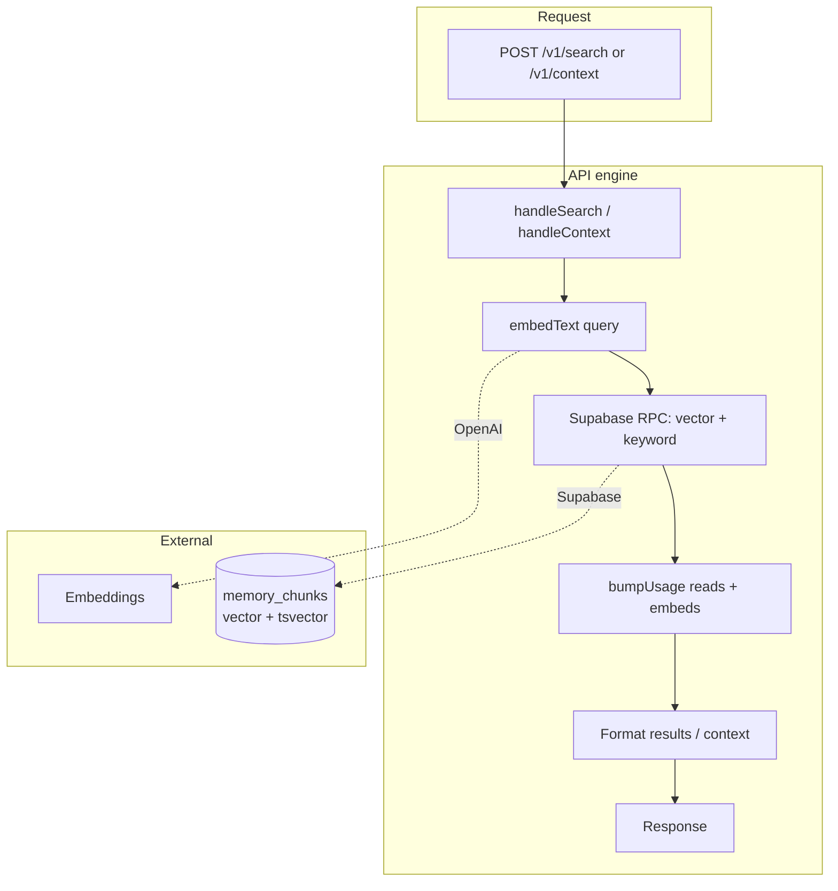
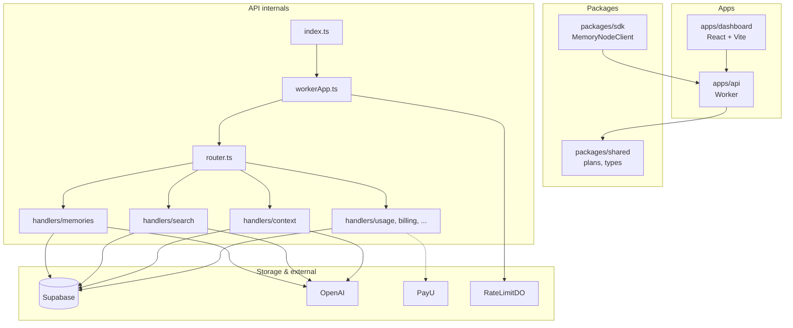

## ⚠️ Internal Operational Document

This document may not reflect real-time production state.  
Always verify against actual infrastructure (Cloudflare, Supabase, etc.).

---

# MemoryNode.ai — Engine Skeleton (Internal Architecture)

> **Supporting reference.** Diagrams mirror the Worker layout; validate handler names and order against `apps/api/src/router.ts` and `workerApp.ts` after refactors.

**Purpose:** A technical view of the product’s “engine” — request pipeline, routing, handlers, and how data flows through the system.

---

## 1. Engine overview (inside the API)

```
                    ┌─────────────────────────────────────────────────────────────────┐
                    │                     CLOUDFLARE WORKER (apps/api)                  │
                    │                                                                   │
  Request ────────► │  index.ts (fetch)                                                │
                    │       │                                                           │
                    │       ▼                                                           │
                    │  workerApp.handleRequest()                                        │
                    │       │                                                           │
                    │       ├─► CORS / body size / security / request-id                │
                    │       ├─► /healthz → 200 (early exit)                              │
                    │       ├─► createSupabaseClient(env)                                │
                    │       ├─► Auth: dashboard session OR API key → auditCtx.workspaceId │
                    │       ├─► rateLimit(env)  ◄── RateLimitDO (Durable Object)         │
                    │       │                                                           │
                    │       ▼                                                           │
                    │  router.route()  ── path + method ──► Handler                      │
                    │       │                                                           │
                    │       ▼                                                           │
                    │  Handler (memories | search | context | usage | billing | …)       │
                    │       │                                                           │
                    │       ├──────────────────┬──────────────────┬─────────────────   │
                    │       ▼                  ▼                  ▼                     │
                    │  Supabase           embedText()          bumpUsage()              │
                    │  (Postgres)         (OpenAI)             (caps/limits)            │
                    │       │                  │                     │                 │
                    └───────┼──────────────────┼─────────────────────┼─────────────────┘
                            │                  │                     │
                            ▼                  ▼                     │
                    ┌───────────────┐  ┌───────────────┐              │
                    │   Supabase    │  │   OpenAI      │              │
                    │   (DB + Auth) │  │  embeddings   │              │
                    └───────────────┘  └───────────────┘              │
                                                                     │
                            PayU (billing webhooks / checkout) ◄──────┘
```

---

## 2. Request pipeline (skeleton)

Step-by-step flow inside `workerApp.ts`:



---

## 3. Router → handlers (skeleton)

Path + method map to handler modules:



| Route area      | Paths / methods              | Handler module   |
|-----------------|------------------------------|------------------|
| Memories        | `POST/GET/DELETE /v1/memories`| `handlers/memories.ts` |
| Search          | `POST /v1/search`            | `handlers/search.ts`  |
| Context         | `POST /v1/context`           | `handlers/context.ts` |
| Usage           | `GET /v1/usage/today`        | `handlers/usage.ts`  |
| Billing         | checkout, portal, webhook    | `handlers/billing.ts` |
| Dashboard       | `/v1/dashboard/*`            | session, projects (internal workspaces), apiKeys |
| Admin / Export / Import / Eval | various | respective handlers |

---

## 4. Core data flow: memory write

What happens inside the engine when a memory is created:



---

## 5. Core data flow: search / context

What happens when the app asks for search or context:



---

## 6. Component dependency skeleton



---

## 7. File skeleton (key files)

| Layer        | File(s)              | Role |
|-------------|----------------------|------|
| Entry       | `apps/api/src/index.ts` | Worker `fetch`, exports `RateLimitDO` |
| Pipeline    | `apps/api/src/workerApp.ts` | CORS, auth, Supabase, rate limit, **route()**, handler wiring |
| Routing     | `apps/api/src/router.ts` | Path+method → handler |
| Auth        | `apps/api/src/auth.ts` | API key -> project context (internal workspace); dashboard session |
| Handlers    | `apps/api/src/handlers/*.ts` | Memories, search, context, usage, billing, admin, export, import, workspaces, apiKeys, eval, webhooks |
| Embeddings  | Inline in `workerApp.ts` | `embedText()` → OpenAI or stub |
| Rate limit  | `apps/api/src/rateLimitDO.ts` | Durable Object |
| Storage     | Supabase (Postgres)  | `infra/sql/*.sql` migrations; tables: workspaces, api_keys, memories, memory_chunks, usage_daily, billing, etc. |
| Plans/limits| `packages/shared` + `apps/api/src/limits.js` | Caps, `checkCapsAndMaybeRespond`, `bumpUsage` |

---

*This doc describes the internal engine/skeleton of MemoryNode.ai. For a high-level product view, see [ARCHITECTURE_CEO.md](ARCHITECTURE_CEO.md).*
